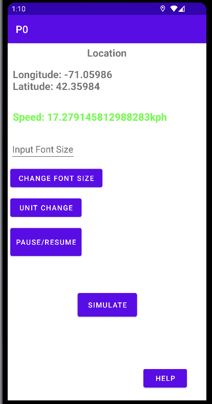

# Project Problem_2-0: 

- ### **Group Member:** `Xingyu Chen, Zhaozhong Qi, Yuxiang Wan, Shuyan Zhang`

- ### **Labor:** There are no subdivisions to indicate which member has finished a particular part; Instead, each team member helps the other and distributes fairly to build all the functionalities of this APP, including all features of the buttons and attributes of the APP. 

## Introduction:

Note: This project was bootstrapped with the Platform of Android maintained in Java Language, which can be found in the details of [Android API 13](https://developer.android.com/about). API and Reference: Android 13, the latest version of Android, includes stronger protections for user privacy, and improvements for developer productivity.

In this project, our team designed and developed an a simple Android application that satisfies the following specifications:

- It has access to the phone's GPS unit to get regular updates of location information.
- It calculates and displays the speed at which the phone is moving (in miles per hour), based on the GPS data.

About more information about the Current Androud system or Platform, please find the page in the Helpful Sections: 

### Functionalities: 

-   `Change Font Size`: Allow the user to change the size of the font being used to display the speed.

-   `Pause/Resume`: A pause button that allows the user to Pause/Resume the Display and Updates data of GPS and Speed.

-   `Unit Change`: Allow the user to change the units in which the speed is being displayed.

-   `Simulate`: The button allowed the user to switch over to the alternative mode: **TEST**, where the location updates are provided not from GPS but rather from a synthetic (simulated) source traveling 10 miles per hour.

-   `HELP`: The button will help you jump to the display of helpful information on how to use the app.

#### Except for those basic integrated Button, The APP also possesses the following attributes while playing the GPS and Speed Data: 

### Basic Attributes: 

1. **GPS:** Current / Simulate Relative Location data in **(Longitude, Latitude)**. 
2. **Speed:** Current / Simulate Speed of the phone.
3. **Two alternative mode:** Simulate / Real-time. Simulate Mode is introduced like above, The Real-time mode just displays the current Real-time Location and Speed data.
4. **Color change:** The color of the speed display will vary based on the travel speed being detected by the Phone.

---

#### Before you run with the code and build the project, there are several steps needed for environment Setup. Check the following section `#Environment SetUp` to learn about what needs to be installed.

#### The Following pictures are the Interface Preview of the APP: 

 

---

## Environment SetUp: 

We recommend you install the Android Studio and it just takes a few clicks, meanwhile, it will help you build up all the necessary components to enable to run this APP. For more details, check the link: [Install Android Studio](https://developer.android.com/studio/install)

Good Tutorial and examples about setting up, Import and building the project: 

1. [Build your first Android APP in Java](https://developer.android.com/codelabs/build-your-first-android-app?hl=zh-cn#0)
2. [Android Application Fundamentals](https://developer.android.com/guide/components/fundamentals)

