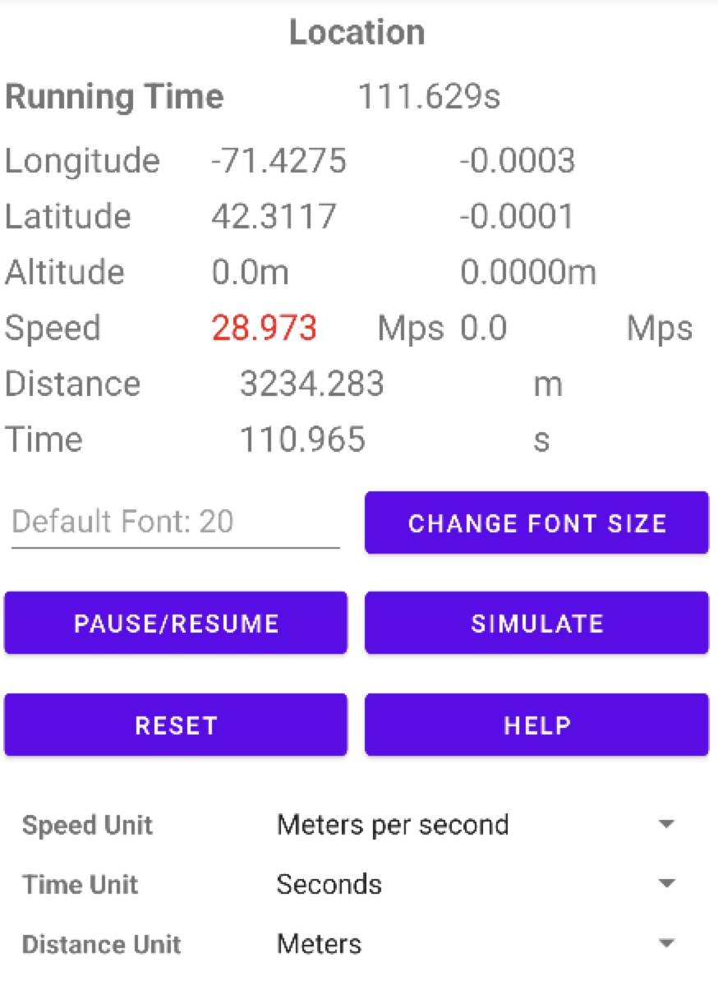

# Project - Problem_2-1: 

- ### **Group Member:** `Xingyu Chen, Zhaozhong Qi, Yuxiang Wan, Shuyan Zhang`

- ### **Labor:** There are no subdivisions to indicate which member has finished a particular part; Instead, each team member helps the other and distributes fairly to build all the functionalities of this APP, including all features of the buttons and attributes of the APP. 

## Introduction:

Note: This project was bootstrapped with the Platform of Android maintained in Java Language, which can be found in the details of [Android API 13](https://developer.android.com/about). API and Reference: Android 13, the latest version of Android, includes stronger protections for user privacy, and improvements for developer productivity.

In this project, our team designed and deployed a simple Android application that satisfies the following specifications:

- Display of the following additional metrics:
  - Elapsed time (in seconds) - since the start of the application (or the last reset);
  - Height of the phone (in meters) - based on GPS data;
  - Distance traveled (in meters) - since the start of the application (or the last reset);
  
- Ability for the user to change units for any measurement, among the following types:
  - Seconds ⟶ Minutes ⟶ Hours ⟶ Days
  - Meters ⟶ Kilometers ⟶ Miles ⟶ Feet
  - Meters per second ⟶ Kilometers per hour ⟶ Miles per hour ⟶ Minutes/mile
  
- An independent location processing thread that handles all location and measurement updates asynchronously.

About more information about the Current Android system or Platform, please find the page in the Helpful Sections: 

### Functionalities: 

 - Individualize Component: 
-   `Change Font Size`: Allow the user to change the size of the font being used to display the speed.

-   `Pause/Resume`: A pause button that allows the user to Pause/Resume the Display and Updates data of GPS and Speed.

-   `Unit Change for Time, Speed and Distance`: Allow the user to change the units in how the speed, time, and distance are being displayed.

-   `Simulate`: The button allowed the user to switch over to the alternative mode: **TEST**, where the location updates are provided not from GPS but rather from a synthetic (simulated) source traveling 10 miles per hour.

-   `HELP`: The button will help you jump to the display of helpful information on how to use the app.

-   `Reset`: A Reset button that allows the user to reset some of the accumulated metrics.

-   Maintain measurement data throughout the application lifecycle.

-   Indicators on existing metrics as to whether they are currently increasing or decreasing (and the magnitude of the change).

-   A database back-end that records historical information over a designated period of time.

-   A "High scores" page that notes the highest and lowest values of the various metrics since the last reset.

-   A "moving time" metric that records the amount of time during which the device has been moving.

---

#### Before you run with the code and build the project, there are several steps needed for environment Setup. Check the following section `#Environment SetUp` to learn about what needed to be installed.

#### The Following pictures are the Interface Preview of the APP: 

 

---

## Environment SetUp: 

We recommend you install the Android Studio it just takes a few clicks, and it will help you build up all the necessary components to run this APP. For more details, check the link: [Install Android Studio](https://developer.android.com/studio/install)

Good Tutorial and examples about setting up, Import and building the project: 

1. [Build your first Android APP in Java](https://developer.android.com/codelabs/build-your-first-android-app?hl=zh-cn#0)
2. [Android Application Fundamentals](https://developer.android.com/guide/components/fundamentals)

