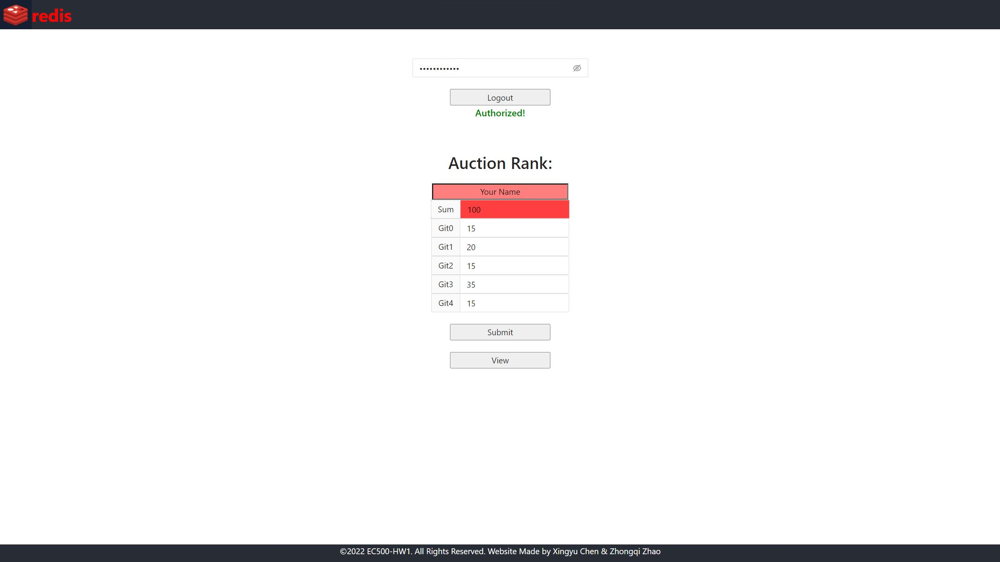

# EC501_HW1 Ranked auction

## Introduction:

- Note: This project was bootstrapped with [Create React App](https://github.com/facebook/create-react-app). 

- **Group Member:** `Xingyu Chen, Zhaozhong Qi`

- In this project, we designed and depolyed a web interface of a client-side a ranked-auction system, similar to the PreHomeworkGroupAuction had as we used in the class.

This APP interface integrated with React component. (For more information about React, check the section of `#Learn More`). React is a JavaScript library for building user interfaces, we use the architecture to build the primer User-Interface that could interact with Redis server by using only pure HTML, CSS, JavaScript language.

- As in mention, we also applied an MD5 hash function by using the JavaScript library which could be sourced from: [npm MD5](https://www.npmjs.com/package/md5). 

- Before you running with the code and build the project, there are several steps needed of environment Set-up. Check the following section `#Environment SetUp` to learn about what needed to be installed.

### The mechanism of the webpage has the Five main attributes as the following as shown: 

1. It enable choices to be ranked; In other words, **you must specify the rank for EACH student**, by any rank that you want.
2. The range of valid ranks for each choice ( e.g., integers `0..99`, inclusive on the PreHomeworkGroupAuction).
3. The net sum of ranks allotted to a given user (e.g., 100 on the PreHomeworkGroupAuction, neither allowed SMALLER or LARGER).
4. The wikiname of a student in the class with which to associate the ranking. In other words, you must specify your name, the one(Author) who has edited the table.
5. Mechanism for viewing and/or modifying the ranks that have been submitted by any user(You).

 - The Interface Preview: 

--- 

## Environment Set-up

### **Node.js:**  
- #### `npm`
> `Node.js` is an open-source, cross-platform JavaScript runtime environment, since all the design of our code are basically build on by `Node.js` platform. You will need it to be Set-Up ready on your local devices at the first.

> OR you could [Download the Node.js](https://nodejs.org/en/) by this link.

### **React:**  
- #### Terminal command: `npm i react`
> As we explained above, `React` is a JavaScript library for creating user interfaces and will be necessary for this project.

### **Antd:**  
- #### Terminal command: `npm install antd`
> A React UI library antd that contains a set of high quality components and demos for building rich, interactive user interfaces.

### **Axios:**  
- #### Terminal command: `npm install axios`
> `Axios` is a promise-based HTTP Client for `node.js` and the browser. It is isomorphic (= it can run in the browser and `nodejs` with the same codebase). On the server-side it uses the native `node.js` http module, while on the client (browser) it uses XMLHttpRequests.

### **MD5 hash function:**  
- #### Terminal command: `npm install md5`
> A JavaScript function for hashing messages with MD5. 

---

## Run and build the project

If you follow all the steps and successfully installed the packages from the above explain,
Configuration, you are almost there! 

And NOW you will be able to build the project in your local environment. 

> Since the interface is basically designed by `JavaScript`, the Package Manager `npm` is required to build all the environment variables, `npm` is a package manager for the `JavaScript` programming language, which is the default package manager for the JavaScript runtime environment `Node.js`.

- In the project directory, you can simply build your project by the following command-line:

#### `npm run build`

> Builds the app for production to the `build` folder. It correctly bundles React in production mode and optimizes the build for the best performance.

> The build is minified and the filenames include the hashes. Your app is ready to be deployed! See the section about [deployment](https://facebook.github.io/create-react-app/docs/deployment) for more information.

After you finish the initial Build-Up of the project, you could run the project by:

#### `npm start`

> Runs the app in the development mode.

**Note**: This will open [http://localhost:3000](http://localhost:3000) to view the our designed Integrated Interface in your browser. The page will reload when you make changes. You may also see any lint errors in the console. \

There are several commands that might be helpful to test the the APP interface. But you might not necessary to run them all in the by testing the applicable of this project: 

#### `npm test`

> Launches the test runner in the interactive watch mode. See the section about [running tests](https://facebook.github.io/create-react-app/docs/running-tests) for more information.

#### `npm run eject`

- **Note: this is a one-way operation. Once you `eject`, you can't go back!**

> If you aren't satisfied with the build tool and configuration choices, you can `eject` at any time. This command will remove the single build dependency from your project.

> Instead, it will copy all the configuration files and the transitive dependencies (webpack, Babel, ESLint, etc) right into your project so you have full control over them. All of the commands except `eject` will still work, but they will point to the copied scripts so you can tweak them. At this point you're on your own.

> You don't have to ever use `eject`. The curated feature set is suitable for small and middle deployments, and you shouldn't feel obligated to use this feature. However we understand that this tool wouldn't be useful if you couldn't customize it when you are ready for it.

---

## Learn More

- You can learn more in the [Create React App documentation](https://facebook.github.io/create-react-app/docs/getting-started).
- To learn React, check out the [React documentation](https://reactjs.org/).

### Deployment

> This section has moved here: [https://facebook.github.io/create-react-app/docs/deployment](https://facebook.github.io/create-react-app/docs/deployment)

### `npm run build` fails to minify

> This section has moved here: [https://facebook.github.io/create-react-app/docs/troubleshooting#npm-run-build-fails-to-minify](https://facebook.github.io/create-react-app/docs/troubleshooting#npm-run-build-fails-to-minify)
